# DOKUMENTASI DATA FLOW DIAGRAM (DFD) — AS-IS & TO-BE
## PADU v2.0 Enterprise — Pengolah & Analisis Data Terpadu (DTSEN 2026 Analytics Engine)
### Dilengkapi DFD Level 0, Level 1 (Sekuensial 1.0 s/d 4.0), dan Level 2 Lengkap Berstandar BSSN & UU PDP No. 27/2022

---

> [!NOTE]
> **Pembaruan Arsitektur PADU v2.0 Enterprise**: Berdasarkan kesepakatan final perbaikan sistem, ketergantungan modul biometrik webcam/OpenCV, MediaPipe, dan penguncian paksa OS Windows `user32.dll` telah **DIHAPUS TOTAL**. Sistem bertransformasi menjadi **Aplikasi Web Murni (*Clean Web App*)** dengan otentikasi standar industri *Two-Step Email-First Login*, kebijakan kata sandi minimal 15 karakter (NIST SP 800-63B), *Dynamic PII Masking*, transliterasi foreign key kode BPS, dan komputasi 7 metrik analitik regional DuckDB.

## 1. Ringkasan Arsitektur: Komparasi AS-IS vs TO-BE

Perancangan DFD ini diselaraskan dengan **Swimlane AS-IS** (`swimlane_asis_padu.drawio`), **Swimlane TO-BE** (`swimlane_tobe_padu.drawio`), serta **Cetak Biru PADU v2.0** (`UPDATE_SELANJUTNYA.md`).

| Aspek Komparasi | Kondisi AS-IS (Sistem Awal) | Kondisi TO-BE (PADU v2.0 Enterprise) |
| :--- | :--- | :--- |
| **Entitas Luar (External Entities)** | **1 Entitas**: Hanya Operator Data / Analis. | **1 Entitas Utama**: Operator Data / Analis (dan Super Admin pada modul tata kelola terpisah). Bebas dari entitas sensor kamera & OS hook. |
| **Autentikasi & Keamanan Sesi** | Tanpa otentikasi (langsung klik `.bat` dan terbuka). | **Two-Step Email-First Web Authentication** (Verifikasi Hash Bcrypt, Password Min 15 Karakter, Rate Limiting BSSN No. 4/2021). |
| **Proteksi Akses & PII Data** | Data ditampilkan polos apa adanya (*as-is*) tanpa penyamaran identitas. | **Dynamic PII Masking Engine** menyamarkan NIK (`3201************`), inisial Nama (`B*** S******`), sensor parsial nominal gaji dan alamat RT/RW sesuai UU PDP No. 27/2022. |
| **Transliterasi Foreign Key** | Menampilkan kode angka mentah BPS (misal air: 1, lantai: 3). | **Transliterasi Otomatis FK** mengubah kode angka menjadi teks resmi deskriptif (*Air Kemasan*, *Marmer/Granit*, *Milik Sendiri*). |
| **Format Ekspor Data** | Hanya unduhan file mentah `.csv` biasa. | **Paket Arsip Terkompresi ZIP (DEFLATE)** berisi `data_dtsen.csv`, `audit_error.csv`, dan `metadata.txt` bersertifikat checksum SHA-256. |
| **Data Store yang Terlibat** | **3 Data Store**: `D1 (src-dtsen/)`, `D2 (dtsen_data)`, `D3 (quality_audit_logs)`. | **5 Data Store Terpusat**: `D1 (src-dtsen/)`, `D2 (dtsen_data DuckDB)`, `D3 (quality_audit_logs)`, `D4 (sqlite_users & sessions)`, `D5 (src-export/ & ZIP)`, dan `D_REF (referensi_kamus_data)`. |
| **Pembersihan Jejak & Sesi** | Tanpa manajemen sesi. | **Stateless Secure Session Teardown**: Penghancuran token sesi, sanitasi cookie HttpOnly, dan audit log stempel waktu penutupan. |

---

## 2. DFD SISTEM AS-IS

### 2.1 AS-IS Level 0 — Diagram Konteks

Sistem AS-IS berpusat pada proses analitik dasar dengan satu-satunya aktor eksternal yaitu Operator Data.

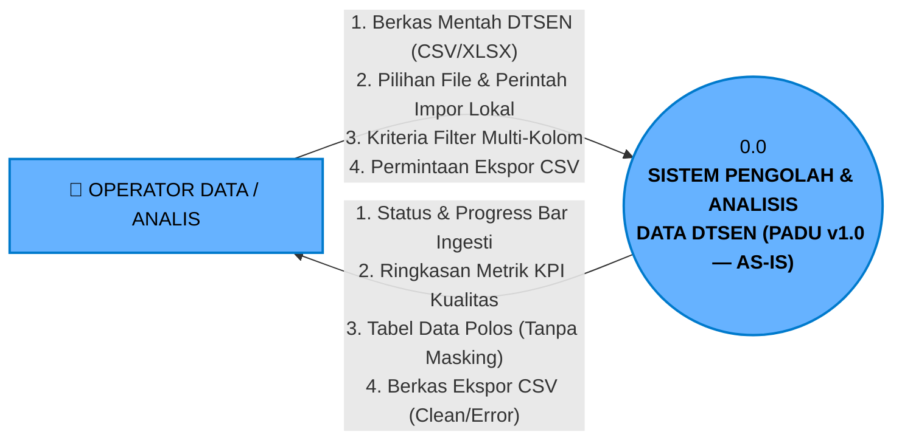

---

### 2.2 AS-IS Level 1 — Dekomposisi Sistem

Terdiri dari 4 sub-proses sekuensial yang mengelola siklus ingesti, audit, visualisasi, dan ekspor CSV:

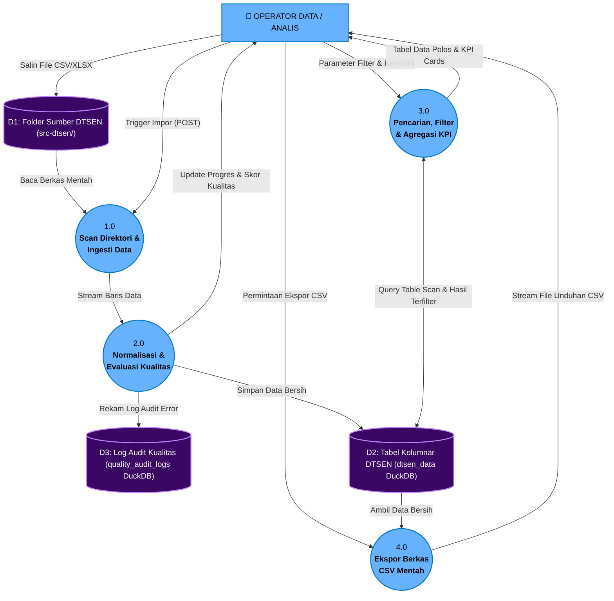

---

### 2.3 AS-IS Level 2 — Dekomposisi 4 Sub-Sistem Eksisting

DFD Level 2 pada sistem AS-IS menguraikan mekanisme fungsional internal dari 4 sub-proses sistem awal (sebelum penambahan pengamanan biometrik dan masking PII):

---

#### 2.3.1 Level 2: Proses 1.0 (Scan Direktori & Ingesti Data)

Menguraikan deteksi file mentah pada folder lokal `src-dtsen/`, verifikasi berkas, penangkapan trigger HTTP POST dari operator, eksekusi script `fast_import.py`, dan penyaluran *raw stream data*.

```mermaid
flowchart LR
    E1["👤 OPERATOR DATA"]
    D1[("D1: Folder Sumber (src-dtsen/)")]

    P11(("1.1<br/>Auto-Scan Direktori<br/>Sumber src-dtsen/"))
    P12(("1.2<br/>Validasi Format &<br/>Ukuran Berkas"))
    P13(("1.3<br/>Penerimaan Trigger<br/>Impor Lokal (POST)"))
    P14(("1.4<br/>Streaming PyArrow<br/>fast_import.py"))
    P15(("1.5<br/>Penyaluran Stream<br/>Baris Mentah"))

    E1 -->|"Salin Berkas CSV/XLSX"| D1
    D1 -->|"Daftar Berkas Mentah"| P11
    P11 -->|"Metadata File Terdeteksi"| P12
    E1 -->|"Trigger Impor POST"| P13
    P12 -->|"Berkas Valid Siap Impor"| P13
    P13 -->|"Inisialisasi fast_import.py"| P14
    P14 -->|"Raw Chunk Records"| P15
    P15 -->|"Stream Baris Data Mentah ke P2.0"| P15

    classDef entity fill:#66B2FF,stroke:#007ACC,stroke-width:2px,color:#000;
    classDef process fill:#66B2FF,stroke:#007ACC,stroke-width:2px,color:#000;
    classDef store fill:#3b0764,stroke:#c084fc,stroke-width:2px,color:#fff;
    class E1 entity;
    class P11,P12,P13,P14,P15 process;
    class D1 store;
```

**Kamus Aliran Data Sub-Proses 1.0 (AS-IS):**
1. **E1 $\rightarrow$ D1**: Pengguna meletakkan file fisik `.csv` atau `.xlsx` ke dalam folder `src-dtsen/`.
2. **P11 $\rightarrow$ P12**: Deteksi nama file dan atribut ukuran byte.
3. **P13 $\rightarrow$ P14**: Pemanggilan sub-proses eksekusi script Python `fast_import.py`.
4. **P14 $\rightarrow$ P15**: Konversi blok biner file mentah ke dalam batch *record* PyArrow.
5. **P15**: Output aliran data mentah diteruskan ke Proses 2.0 (Normalisasi).

---

#### 2.3.2 Level 2: Proses 2.0 (Normalisasi & Evaluasi Kualitas Data)

Menguraikan standarisasi nama kolom ke 48 variabel BPS, pengujian aturan validasi dasar, penyimpanan data bersih ke `dtsen_data`, pencatatan error ke `quality_audit_logs`, dan update file status `import_progress.json`.

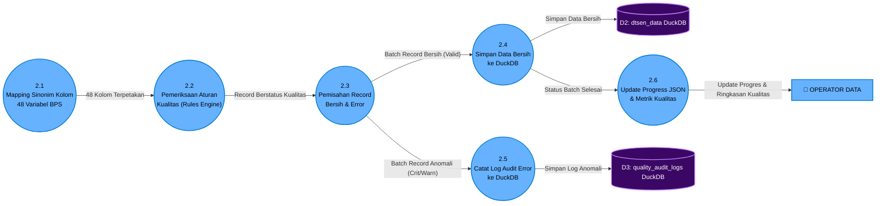

**Kamus Aliran Data Sub-Proses 2.0 (AS-IS):**
1. **P21 $\rightarrow$ P22**: Kolom input dinormalisasi sesuai sinonim 48 variabel BPS.
2. **P22**: Evaluasi kondisi:
   - *Critical*: NIK kosong / != 16 angka, Desil diluar 1-10.
   - *Warning*: Field pendukung kosong.
   - *Valid*: Sesuai format.
3. **P24 $\rightarrow$ D2**: Simpan baris valid langsung ke tabel kolumnar DuckDB `dtsen_data`.
4. **P25 $\rightarrow$ D3**: Simpan anomali ke tabel `quality_audit_logs`.
5. **P26 $\rightarrow$ E1**: Tulis persentase ke `import_progress.json` untuk dibaca progress bar UI operator.

---

#### 2.3.3 Level 2: Proses 3.0 (Pencarian, Filter & Agregasi KPI)

Menguraikan *parser* filter, pembentukan query SELECT DuckDB dinamis, eksekusi table scan, penghitungan count metrik KPI, dan perenderan grid **data polos apa adanya tanpa masking identitas (as-is)**.

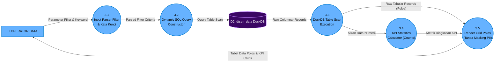

**Kamus Aliran Data Sub-Proses 3.0 (AS-IS):**
1. **E1 $\rightarrow$ P31**: Parameter filter wilayah, NIK, dan desil.
2. **P32 $\rightarrow$ D2**: Query SQL DuckDB standar tanpa vektorisasi lanjutan.
3. **P33 $\rightarrow$ P35**: Data baris mentah dikirim apa adanya ke view:
   - NIK tampil 16 digit utuh (tanpa sensor).
   - Nama lengkap tampil jelas (tanpa sensor).
   - Gaji dan alamat tampil polos.
4. **P35 $\rightarrow$ E1**: Tampilan tabel HTML 50 baris per halaman dan kartu KPI.

---

#### 2.3.4 Level 2: Proses 4.0 (Ekspor Berkas CSV Mentah)

Menguraikan penerimaan permintaan ekspor, penarikan data bersih atau log error dari DuckDB, format ke teks CSV polos, dan *direct streaming download* ke browser tanpa kompresi arsip ZIP.

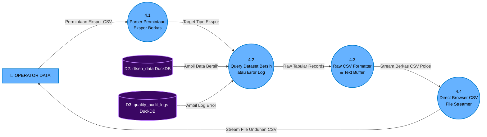

**Kamus Aliran Data Sub-Proses 4.0 (AS-IS):**
1. **E1 $\rightarrow$ P41**: Tombol klik unduh CSV dari browser.
2. **P42 $\rightarrow$ P43**: Penarikan baris data dari `dtsen_data` atau `quality_audit_logs`.
3. **P43 $\rightarrow$ P44**: Penggabungan teks berkoma (.csv) tanpa metadata log atau kompresi ZIP.
4. **P44 $\rightarrow$ E1**: File `.csv` polos diunduh langsung oleh browser pengguna.

---

## 3. DFD SISTEM TO-BE

### 3.1 TO-BE Level 0 — Diagram Konteks

Sistem TO-BE PADU v2.0 Enterprise berpusat pada aplikasi web murni tanpa ketergantungan perangkat keras kamera/sensor eksternal. Sistem melayani Operator Data melalui otentikasi kredensial standar industri, navigasi dua modul utama (**Data Mikro** dan **Data Statistik Regional**), transliterasi FK kode angka ke label deskriptif, kalkulasi 7 metrik agregasi dinamis, dan ekspor arsip ZIP terkompresi.

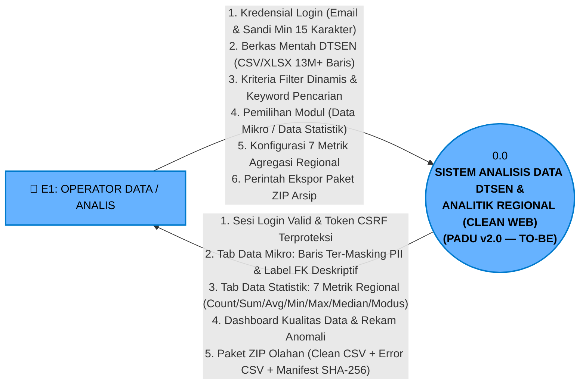

---

### 3.2 TO-BE Level 1 — Dekomposisi Sistem (Sekuensial Bersih 1.0 s/d 4.0)

Pada arsitektur PADU v2.0 Enterprise, seluruh sub-proses disusun secara berurutan (*chronological pipeline*) bersih dari **kiri ke kanan**:
**1.0 (Otentikasi & Sesi)** $\rightarrow$ **2.0 (Ingesti Data & Kualitas)** $\rightarrow$ **3.0 (Analitik Dual-Modul & 7 Metrik)** $\rightarrow$ **4.0 (Ekspor Paket ZIP)**.

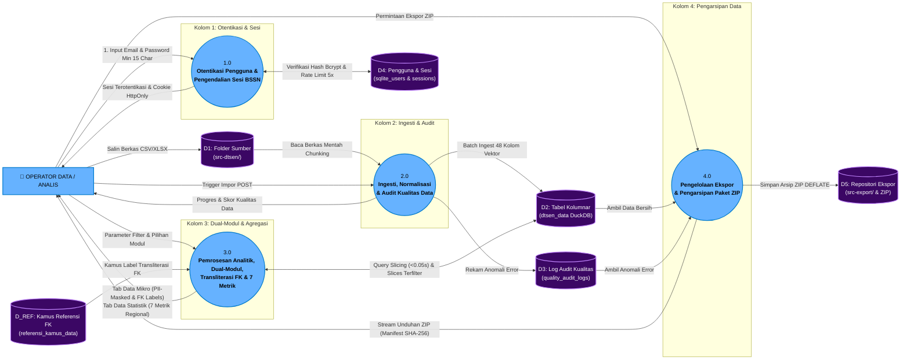

---

## 4. DFD SISTEM TO-BE LEVEL 2 (DEKOMPOSISI 4 SUB-SISTEM INTI)

DFD Level 2 menguraikan rincian algoritma internal dari setiap proses induk pada Level 1:

---

### 4.1 Level 2: Proses 1.0 — Otentikasi Pengguna & Pengendalian Sesi BSSN

Menguraikan mekanisme alur *Two-Step Email-First Login*, verifikasi hash kriptografis Bcrypt, proteksi *brute-force rate limiting* (maksimal 5 kali kegagalan dengan jeda *lockout*), penerbitan sesi terproteksi *HttpOnly / SameSite*, dan audit pencatatan akses.

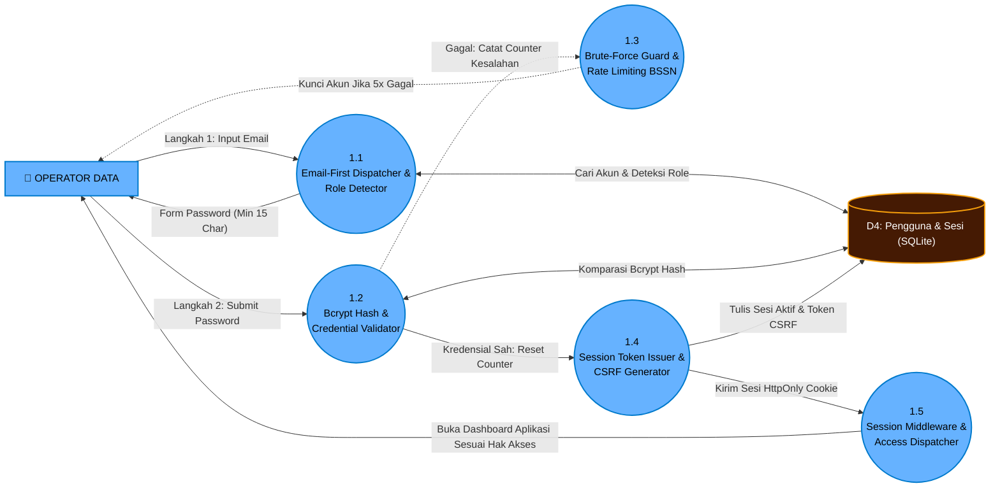

**Kamus Aliran Data Sub-Proses 1.0:**
1. **1.1 $\rightarrow$ D4**: Pengecekan keberadaan akun dan status peran (*Operator* atau *Super Admin*).
2. **1.2 $\rightarrow$ D4**: Verifikasi hash kata sandi Bcrypt dengan *cost factor* $\ge 12$.
3. **1.3 $\rightarrow$ E1**: Penerapan standar BSSN No. 4/2021: penahanan sesi (*lockout*) 15 menit jika terjadi 5 kali kegagalan berturut-turut.
4. **1.4 $\rightarrow$ D4**: Penerbitan sesi aman di tabel `sessions` dengan *cryptographically secure token*.
5. **1.5 $\rightarrow$ E1**: Navigasi lancar ke antarmuka aplikasi.

---

### 4.2 Level 2: Proses 2.0 — Ingesti, Normalisasi & Audit Kualitas Data

Menguraikan mekanisme *zero-copy streaming* PyArrow, standarisasi 48 variabel individu & 52 variabel KK BPS, pengujian aturan integritas (Valid/Warning/Critical), dan persistensi *dual-table* DuckDB.

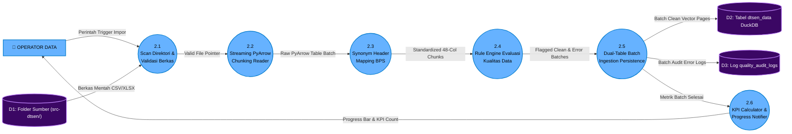

**Kamus Aliran Data Sub-Proses 2.0:**
1. **P21 $\rightarrow$ P22**: Pointer berkas valid setelah diverifikasi ukuran dan ekstensinya.
2. **P22 $\rightarrow$ P23**: Chunk tabel memori PyArrow (500k-1M baris per blok, throughput > 1.5M baris/detik).
3. **P23 $\rightarrow$ P24**: 48 kolom terstandarisasi berdasarkan kamus sinonim variabel resmi BPS.
4. **P24 $\rightarrow$ P25**: Baris data terklasifikasi:
   - **Critical**: NIK != 16 digit, Nama mengandung angka/karakter asing, Desil <1 atau >10, Usia <0 atau >120.
   - **Warning**: Atribut opsional bernilai kosong (*missing values*).
   - **Valid**: Seluruh integritas atribut terpenuhi.
5. **P25 $\rightarrow$ D2 & D3**: Penyimpanan vektor kolumnar ke `dtsen_data` dan rekaman anomali ke `quality_audit_logs`.

---

### 4.3 Level 2: Proses 3.0 — Pemrosesan Analitik, Dual-Modul, Transliterasi FK & 7 Metrik

Menguraikan *parser* query & *dispatcher* modul, pemotongan vektor memori (*memory-mapped slicing*) DuckDB dalam < 0.05 detik, penyamaran privasi (*PII Dynamic Masking*), penerjemahan kode numerik (*Transliterasi FK via referensi_kamus_data*), kalkulasi 7 metrik agregasi regional, serta penyajian 2 halaman antarmuka terpisah (**Data Mikro** vs **Data Statistik**).

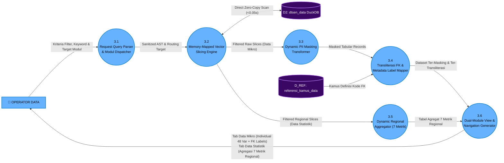

**Kamus Aliran Data Sub-Proses 3.0:**
1. **P31 $\rightarrow$ P32**: Parameter filter ternormalisasi (NIK, KK, Provinsi, Kabupaten, Kecamatan, Desa, Desil, Status) beserta pilihan modul tampilan aktif (*Tab Data Mikro* vs *Tab Data Statistik*).
2. **P32 $\rightarrow$ P33**: Blok data baris individu untuk penyamaran identitas:
   - **NIK**: `3201************` (hanya tampil 4 digit awal).
   - **Nama**: `B*** S******` (inisial huruf pertama tiap suku kata).
   - **Gaji**: `Rp 8.xxx.xxx`.
   - **Alamat/RT/RW**: Disensor parsial.
3. **P33 $\rightarrow$ P34 & D_REF $\rightarrow$ P34**: Penukaran kode numerik menjadi teks deskriptif (*transliterasi label*):
   - `sumber_air_minum_utama: "01"` $\rightarrow$ `"Air Kemasan Bermerk"`.
   - `jenis_lantai_terluas: "01"` $\rightarrow$ `"Marmer / Granit"`.
   - `status_kepemilikan_rumah: "1"` $\rightarrow$ `"Milik Sendiri"`.
4. **P32 $\rightarrow$ P35**: Aliran data numerik dan kategoris untuk kalkulasi dinamis **7 Metrik Agregasi Regional**:
   - `COUNT` (Jumlah Jiwa / Rumah Tangga).
   - `SUM` (Total Nominal Gaji/Bansos).
   - `AVG` (Rata-rata Usia/Penghasilan).
   - `MIN` (Nilai Minimum).
   - `MAX` (Nilai Maksimum).
   - `MEDIAN` (Nilai Tengah Distribusi).
   - `MODUS` (Kategori/Nilai Terbanyak).
5. **P36 $\rightarrow$ E1**: Pilihan navigasi tab terpisah:
   - **Tab 1: Data Mikro** (Tampilan baris perorangan terintegrasi kepala keluarga & anggota, tersensor PII, dan ter-transliterasi FK).
   - **Tab 2: Data Statistik Regional** (Tabel dan grafik rekapitulasi multi-level wilayah Kab/Kota, Kecamatan, dan Kelurahan dengan 7 metrik analitik).

---

### 4.4 Level 2: Proses 4.0 — Pengelolaan Ekspor & Pengarsipan Paket ZIP

Menguraikan pengambilan dataset hasil filter dan rekaman audit error, serialisasi CSV terkompresi memori, pembuatan berkas manifest integritas (*metadata.txt*) bersertifikat SHA-256, pembuatan arsip ZIP di folder `src-export/`, serta pengaliran unduhan ke browser operator.

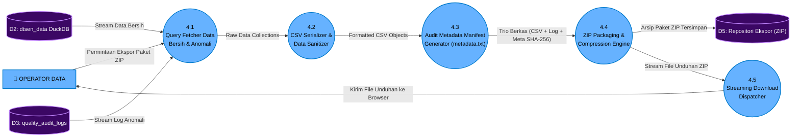

**Kamus Aliran Data Sub-Proses 4.0:**
1. **P41 $\rightarrow$ P42**: Hasil seleksi data bersih dan anomali sesuai filter aktif.
2. **P42**: Serialisasi berkas `data_dtsen.csv` dan `audit_error.csv`.
3. **P43**: Berkas `metadata.txt` berisi waktu ekspor, operator, kriteria filter, total baris, dan checksum hash SHA-256 untuk sertifikasi integritas berkas.
4. **P44 $\rightarrow$ D5**: Paket arsip `.zip` tersimpan di direktori `src-export/`.
5. **P45 $\rightarrow$ E1**: Header HTTP `application/zip` untuk *direct stream download* ke browser operator.

---

## 5. Struktur Tab pada Berkas Draw.io Multi-Tab

Seluruh diagram kini telah diselaraskan dalam berkas diagram draw.io sistem yang mencakup **12 tab interaktif terstruktur**:

| No Tab | Nama Tab di Draw.io | Tingkatan & Sifat | Keterangan Tata Letak |
| :---: | :--- | :--- | :--- |
| **1** | `AS-IS Level 0 (Diagram Konteks)` | AS-IS Context (Lvl 0) | Sistem lama berpusat pada 1 proses sentral dan Operator. |
| **2** | `AS-IS Level 1 (Dekomposisi Sistem)` | AS-IS Overview (Lvl 1) | 4 sub-proses sekuensial sistem eksisting dan 3 data store. |
| **3** | `AS-IS Level 2 - P1.0 (Scan & Ingesti Data)` | AS-IS Child (Lvl 2) | Dekomposisi 1.1 s/d 1.5 (Folder scan, validasi, fast_import.py). |
| **4** | `AS-IS Level 2 - P2.0 (Normalisasi & Evaluasi Kualitas)` | AS-IS Child (Lvl 2) | Dekomposisi 2.1 s/d 2.6 (Mapping kolom, quality rules, DuckDB). |
| **5** | `AS-IS Level 2 - P3.0 (Pencarian & Agregasi KPI)` | AS-IS Child (Lvl 2) | Dekomposisi 3.1 s/d 3.5 (Query scan & render data polos tanpa masking). |
| **6** | `AS-IS Level 2 - P4.0 (Ekspor CSV Mentah)` | AS-IS Child (Lvl 2) | Dekomposisi 4.1 s/d 4.4 (Query & download file CSV mentah). |
| **7** | `TO-BE Level 0 (Diagram Konteks)` | TO-BE Context (Lvl 0) | Sistem Clean Web App murni Operator Data tanpa ketergantungan kamera/OS hook. |
| **8** | `TO-BE Level 1 (Dekomposisi Sistem)` | TO-BE Overview (Lvl 1) | **Proses 1.0 s/d 4.0 tersusun lurus dari kiri ke kanan**. |
| **9** | `TO-BE Level 2 - P1.0 (Otentikasi & Sesi BSSN)` | TO-BE Child (Lvl 2) | Dekomposisi 1.1 s/d 1.5 (Two-Step Login, Bcrypt, Rate Limiting 5x BSSN). |
| **10** | `TO-BE Level 2 - P2.0 (Ingesti & Audit Kualitas)` | TO-BE Child (Lvl 2) | Dekomposisi 2.1 s/d 2.6 (PyArrow Chunking, Synonym Mapping, Dual-Table). |
| **11** | `TO-BE Level 2 - P3.0 (Analitik & PII Masking)` | TO-BE Child (Lvl 2) | Dekomposisi 3.1 s/d 3.5 (DuckDB Slicing, Dynamic Masking, Transliterasi FK, 7 Metrik). |
| **12** | `TO-BE Level 2 - P4.0 (Ekspor Paket ZIP)` | TO-BE Child (Lvl 2) | Dekomposisi 4.1 s/d 4.5 (CSV Serializer, Manifest Metadata SHA-256, ZIP Packaging). |

Seluruh elemen telah divalidasi memiliki styling `html=1` aktif, bebas tumpukan (*zero overlap*), garis ortogonal rapi, dan ukuran kanvas lapang yang siap diekspor ke PDF/PNG.
