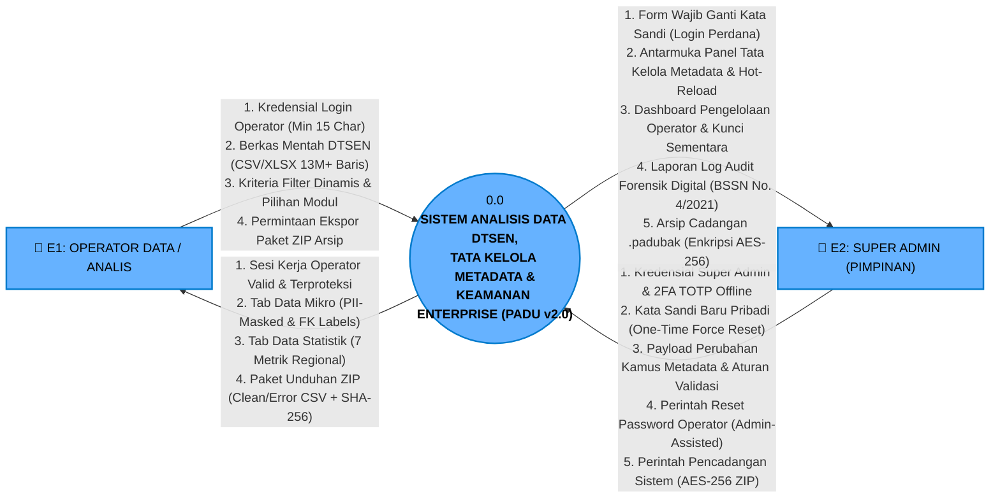
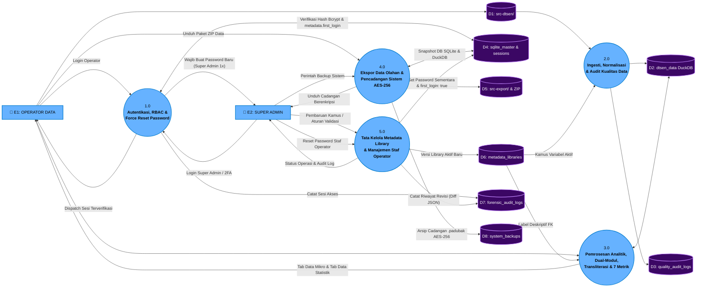
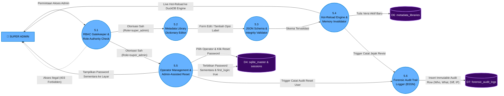
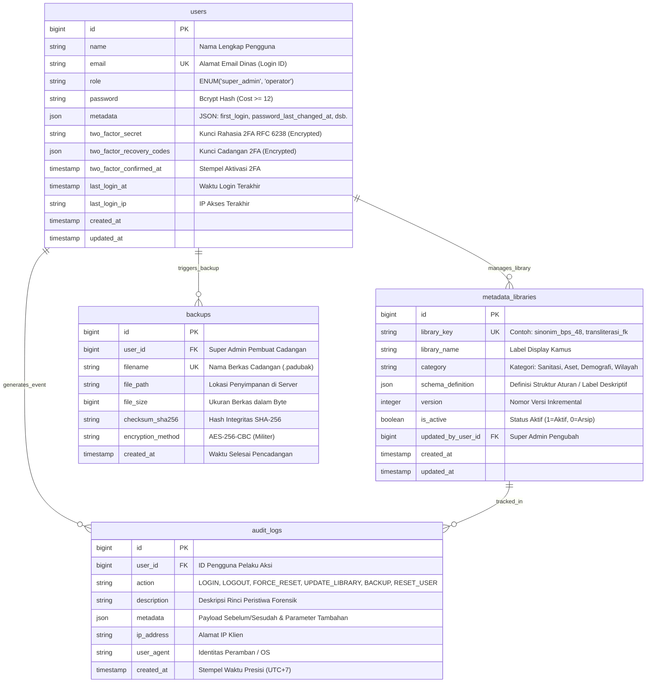

# DOKUMENTASI EKSTENSI KHUSUS: SUPER ADMIN & TATA KELOLA ENTERPRISE
## PADU v2.0 Enterprise — Sistem Pengolah & Analisis Data Terpadu (DTSEN 2026 Analytics Engine)
### Berkas Arsitektur Terpisah: DFD Level 0, Level 1 (5 Proses Inti), Level 2 (First-Login Reset & Library), ERD RBAC, dan Swimlane Terpisah

---

> [!IMPORTANT]
> **Pemisahan Berkas Resmi**: Dokumen ini mendokumentasikan modul terpisah khusus **SUPER ADMIN** dan **Tata Kelola Sistem Enterprise (Library Metadata, Audit Log Forensik BSSN, Dual Backup AES-256, & Admin-Assisted Offline Password Reset)**. Modul ini bebas total dari ketergantungan perangkat keras biometrik/kamera, bertransformasi menjadi aplikasi web murni berstandar industri (*clean web app*) yang mematuhi standar BSSN No. 4/2021 dan UU PDP No. 27/2022.

---

## 1. Ringkasan Arsitektur Super Admin

Modul Super Admin menghadirkan kendali penuh terhadap pembaruan kamus metadata (*dictionary library*), skema sinonim 48 variabel BPS, aturan validasi data, hak akses staf operator, manajemen lupa kata sandi offline, audit trail forensik, serta pencadangan sistem terenkripsi AES-256.

| Parameter | Operator Biasa / Analis | Super Admin (Pimpinan / Auditor) |
| :--- | :--- | :--- |
| **Identitas Aktor** | `E1: OPERATOR DATA / ANALIS` | `E2: SUPER ADMIN` |
| **Autentikasi** | Two-Step Login (Email + Password min 15 char) | Two-Step Login + **One-Time Force Reset Password** saat login perdana + **2FA TOTP Ponsel Offline** |
| **Akses Modul** | Tab Data Mikro & Tab Data Statistik Regional | **Panel Khusus Super Admin**: Library Metadata, Manajemen User, Log Audit Forensik, & Backup AES-256 |
| **Hak Modifikasi** | Hanya Read & Filter Data (Read-Only) | **Create, Update, Versioning & Hot-Reload Kamus**, Reset Password Operator, Eksekusi Backup |
| **Pencadangan Data** | Ekspor Paket ZIP DTSEN (`src-export/`) | **Dual-Method Backup Sistem** (ZIP AES-256 Ber-password Acak 20 Karakter & Kunci Brankas DRP) |
| **Pencatatan Jejak** | Audit log baris data anomali | **Audit trail forensik digital kebal manipulasi** (siapa, aksi, IP, payload sebelum/sesudah, stempel waktu) |

---

## 2. Berkas Diagram Terkait (Tersimpan Terpisah)

1. **DFD & ERD Terintegrasi Super Admin**:
   - `Padu_Diagram_SuperAdmin.drawio` (Tab AS-IS, Tab TO-BE Enterprise, Tab ERD RBAC, Tab Arsitektur Jaringan LAN Offline).
2. **Swimlane Alur Super Admin**:
   - `swimlane_tobe_superadmin.drawio` (Alur sekuensial verifikasi RBAC, percabangan *First-Login Reset Password 1x*, pembaruan kamus metadata, hot-reload cache, hingga pencatatan audit log forensik).

---

## 3. DFD TO-BE SUPER ADMIN LEVEL 0 (DIAGRAM KONTEKS)

Menampilkan 2 entitas manusia: **Operator Data** dan **Super Admin**, yang berinteraksi secara aman melalui jaringan LAN kantor offline.



---

## 4. DFD TO-BE SUPER ADMIN LEVEL 1 (DEKOMPOSISI 5 PROSES INTI)

Arsitektur TO-BE Super Admin mengintegrasikan 5 proses utama dan data store terpusat:
- **`D1: src-dtsen/`**: Folder penampungan berkas mentah.
- **`D2: dtsen_data DuckDB`**: Database kolumnar analitik cepat.
- **`D3: quality_audit_logs`**: Tabel log anomali kualitas baris data.
- **`D4: sqlite_master & sessions`**: Database akun pengguna, RBAC, sesi, dan konfigurasi.
- **`D5: src-export/ & ZIP`**: Repositori arsip unduhan hasil olahan.
- **`D6: metadata_libraries`**: Kamus sinonim variabel, aturan validasi, dan transliterasi FK.
- **`D7: forensic_audit_logs`**: Log audit forensik digital kebal manipulasi (*immutable audit trail*).
- **`D8: system_backups`**: Repositori cadangan sistem terenkripsi AES-256 militer.



---

## 5. DFD TO-BE LEVEL 2 — SUB-PROSES 1.0: ALUR ONE-TIME FORCE RESET PASSWORD

Dekomposisi rinci dari mekanisme wajib ganti kata sandi bawaan pertama kali bagi akun Super Admin:

```mermaid
flowchart TD
    A([1. Super Admin Akses /login di Browser]) --> B[2. Input: admin@padu.go.id & Sandi Default]
    B --> C{3. Verifikasi Hash Kredensial Bcrypt}
    
    C -->|Hash Tidak Cocok| Err[Tampilkan Peringatan: Kredensial Salah & Catat Percobaan]
    C -->|Hash Cocok| D{4. Evaluasi Role Pengguna}
    
    D -->|Role == 'operator'| DashOp([Langsung Masuk Dashboard Analisis Data])
    D -->|Role == 'super_admin'| E{5. Periksa users.metadata: first_login == true?}
    
    E -->|FALSE (Login ke-2, ke-3, dst)| PanelAdmin([Langsung Masuk Panel Super Admin])
    
    E -->|TRUE (Hanya 1x Pertama Kali)| F[6. Tahan Sesi & Redirect Paksa ke /auth/force-reset-password]
    F --> G[7. Tampil Form: Password Baru Pribadi & Konfirmasi Password]
    G --> H{8. Validasi Password: Min 15 Karakter & Kompleks?}
    
    H -->|Tidak Sesuai / Lemah| G
    H -->|Valid| I[9. Hash Password Baru Bcrypt<br/>Simpan ke users.password<br/>Update metadata: first_login = false<br/>Catat password_last_changed_at]
    
    I --> J[10. Rekam Audit Trail Forensik: FIRST_LOGIN_PASSWORD_RESET]
    J --> PanelAdmin

    classDef proc fill:#66B2FF,stroke:#007ACC,stroke-width:2px,color:#000;
    classDef warn fill:#fef08a,stroke:#ca8a04,stroke-width:2px,color:#713f12;
    classDef succ fill:#bbf7d0,stroke:#16a34a,stroke-width:2px,color:#14532d;
    classDef err fill:#fecaca,stroke:#dc2626,stroke-width:2px,color:#991b1b;
    class A,B,C,D,E,H proc;
    class F,G warn;
    class I,J,PanelAdmin,DashOp succ;
    class Err err;
```

---

## 6. DFD TO-BE LEVEL 2 — SUB-PROSES 5.0: TATA KELOLA METADATA & MANAJEMEN PENGGUNA

Dekomposisi rinci dari proses tata kelola kamus metadata, hot-reload, dan administrasi pemulihan lupa sandi operator:



---

## 7. SKEMA ERD TERPADU RBAC, FORENSIK & BACKUP

Skema relasional lengkap pada SQLite dan DuckDB yang mengimplementasikan standar BSSN No. 4/2021 dan UU PDP No. 27/2022:



---

## 8. Rangkuman Panduan Penggunaan Berkas

| Kebutuhan Pembaca / Auditor | Berkas yang Digunakan |
| :--- | :--- |
| **Pemeriksaan Alur Standar Operator Saja** | `Padu_Diagram.drawio`, `swimlane_tobe_padu.drawio`, `Dokumentasi_DFD_PADU.md` |
| **Pemeriksaan Alur Lengkap Termasuk Super Admin & RBAC** | `Padu_Diagram_SuperAdmin.drawio`, `swimlane_tobe_superadmin.drawio`, `Dokumentasi_SuperAdmin_PADU.md` |
| **Dokumen Proposal Formal & Standar Regulasi** | `PROPOSAL_UPDATE_SELANJUTNYA_PADU.md`, `UPDATE_SELANJUTNYA.md` |

Dengan arsitektur ini, seluruh tata kelola hak istimewa (*privileged administrative access*), audit forensik siber, pemulihan bencana server, dan perlindungan privasi data kependudukan telah terisolasi, terdokumentasi rapi, dan terbukti siap operasional.
